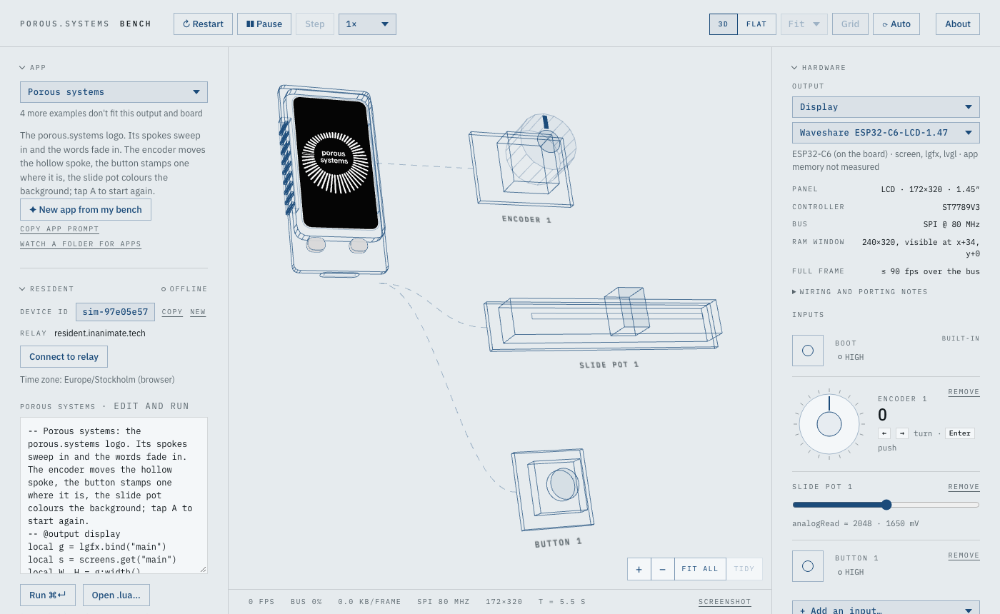
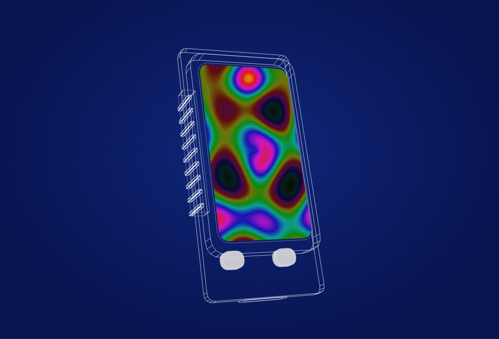
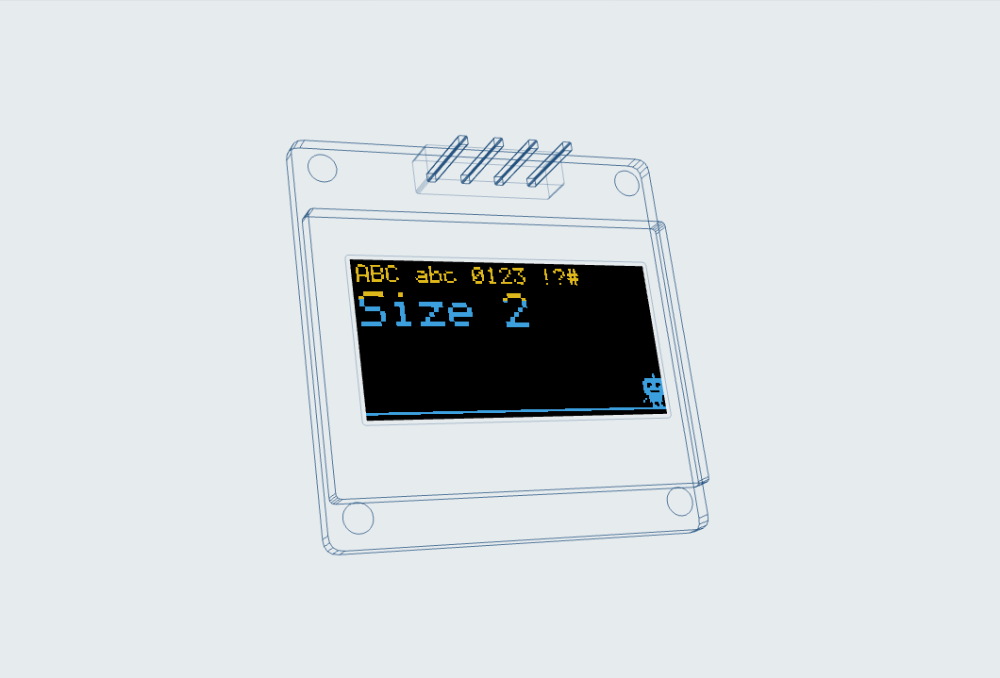
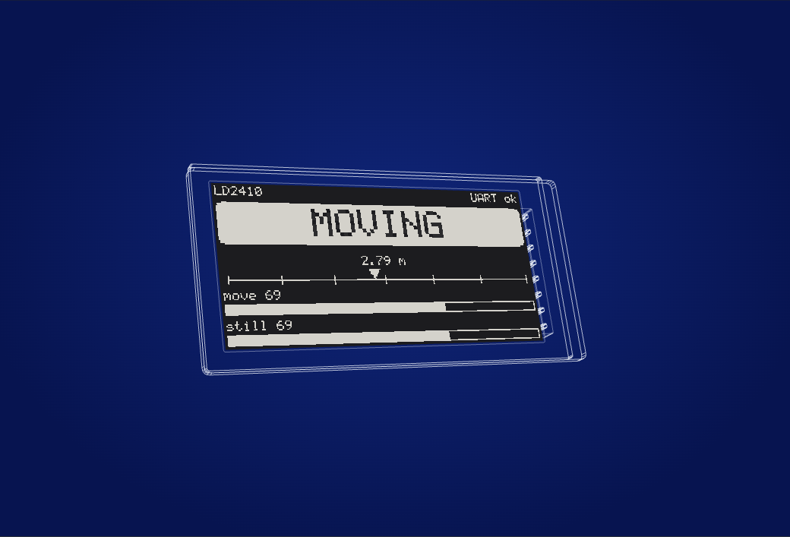
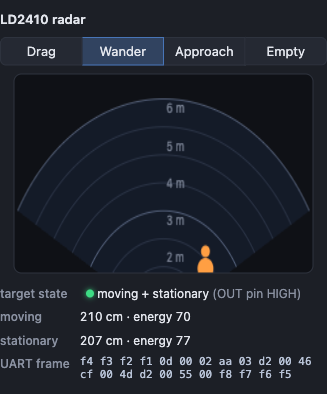

# porous.systems Bench

**A workbench in the browser for ESP32 hardware: an output (a small LCD, OLED, AMOLED or e-paper
display, or a WS2812 LED strip, ring or matrix) and the buttons, knobs and sensors you wire to it, laid out
on a desk.** Apps are Lua, written
for [Resident](https://github.com/inanimate-tech/resident)'s runtime: try animations, fonts and UI
ideas without flashing hardware, switch the display under your code with one click, and push the same
app to a real device. Bench can also join the Resident relay as a device.

**Try it: [bench.porous.systems](https://bench.porous.systems)**



<table>
  <tr>
    <td></td>
    <td></td>
  </tr>
  <tr>
    <td align="center">Waveshare ESP32-C6-LCD-1.47 · 172×320 ST7789</td>
    <td align="center">0.96″ SSD1306 OLED, yellow/blue glass</td>
  </tr>
  <tr>
    <td></td>
    <td align="center"></td>
  </tr>
  <tr>
    <td align="center">2.13″ e-paper, partial refreshes and all</td>
    <td align="center">Simulated LD2410 radar, down to the UART bytes</td>
  </tr>
</table>

## Quick start

Requires Node.js 22.12 or newer, on an even-numbered release (22, 24, 26 and on): the test runner
doesn't support the odd ones.

```sh
git clone https://github.com/sjunnesson/porous-bench.git
cd porous-bench
npm install
npm run dev        # → http://localhost:5199
```

The page has three columns. The **left** column holds the app: pick an **App**, edit its **Code**,
**Receive apps** from Claude Code (over Resident's relay or from a folder), mirror it to a **Real
device**, and read the **Console**. The **desk** is in the middle. The **right** column holds
the hardware: **Output**, where you choose what the app draws on, **Inputs**, where you put parts on
the bench, and **Connections**, where you decide which part drives each of the app's controls. Click a section's
heading to fold it away. **About**, top right, says what Bench is and what it's built on. Everything you set up (the output, your parts, the connections, where things
sit on the desk, folded sections) is saved in this browser and comes back on your next visit.
Everything runs locally in the browser;
`npm run build` produces a static site you can host anywhere. On Vercel, `vercel.json` adds the
relay rewrite (below) and the headers: a Content-Security-Policy that lets the page reach only its
own origin and the relay's WebSocket (add yours to `connect-src` if you use another relay), and
long caching for the hashed files in `assets/`. bench.porous.systems counts page
views with Vercel Web Analytics: no cookies, and nothing about your apps or your bench.

## What it does

- **Displays as data.** Each display is one profile file: resolution, technology, controller, bus
  speed, wiring, porting notes and its physical enclosure. Add a file and it appears in the menu.
- **Real constraints.** `show()` takes as long as pushing the changed pixels over the real SPI or
  I2C bus, so frame rates are honest (≈40 fps ceiling on a 400 kHz I2C OLED). E-paper refreshes take
  their real 2 s / 0.3 s, flash on a full refresh and leave ghosting after partial ones.
- **One kind of app: Lua, the Resident way.** `init`, `on_tick` at 10 FPS, `on_event`, drawing with
  `lgfx`. Resident apps run unmodified, and Bench adds drivers for the hardware on its desk.
- **Outputs.** Display modules, or addressable LEDs: a WS2812B strip (8–144 LEDs), a ring (12, 16,
  24) or a matrix (8×8, 16×16, 32×8), glowing in both views and timed on the real 800 kHz one-wire bus.
- **Your bench.** Add and remove inputs: push buttons, a rotary encoder, a slide pot, a touch pad, an
  IMU you tilt and shake, an HLK-LD2410 radar, a PIR motion sensor, a light sensor, a temperature /
  humidity sensor and a buzzer you can hear. The board brings its own (the M5StickC's buttons, IMU and
  buzzer). Each part has a widget and a 3D model on the desk.
- **Connections.** An app declares the controls it needs ("speed", "next"); you connect each one to a
  part on the bench, and can rewire it while the app runs.
- **An app from your bench.** **✦ New app from my bench** writes a Lua app for the output and parts
  you've chosen: a control for every input, connected to its part and shown live, ready to edit.
- **A prompt for Claude.** **Copy app prompt** copies a ready-to-paste prompt for writing a new app in
  Claude Code: the output, every part on the bench with its `connect` ids, how the open app is wired,
  that app as a reference, the Resident plugin skills and Bench's device skill to use, and how to
  deliver it: into a folder Bench watches, or pushed over the relay.
- **Watch a folder.** Point Bench at a folder and any `.lua` saved there runs immediately.
- **Drive a real device.** **Real device → Mirror** runs the open app on a Resident device on your
  desk and drives it with the inputs on this bench: turn the virtual encoder, wave at the virtual PIR,
  and the real display follows.
- **Time control.** Pause, single-step and run at 0.1×–4×. Delays, bus transfers, refreshes and
  sensor data all follow the simulated clock.
- **Three views.** A ghosted 3D wireframe of the actual part, with the live screen on it; the bare
  glass, flat and pixel-exact, with zoom and a pixel grid; or **Wiring**, the bench as a wiring
  diagram to build it on a real desk.
- **The whole bench in 3D.** Inputs the device doesn't have sit on the desk beside it as parts you
  can use: a rotary encoder (drag the ring, press the centre, scroll), tactile buttons, a slide pot,
  a piezo that pulses while it sounds, and the LD2410 with its detection fan and a little character
  who walks, blinks and looks around; click anywhere to send it walking there, or pick it up by the head to carry it. Each part is wired back
  to the device. With an IMU the device itself tilts and shakes.
- **Hot reload.** Edit an app in the code panel and press Run (⌘↵), open a `.lua` file (**Open
  .lua…**) or drop one on the device, or save a bundled one: it restarts in place.

## Displays

| Display | Technology | Resolution | Bus |
|---|---|---|---|
| Waveshare ESP32-C6-LCD-1.47 | IPS LCD, ST7789V3, rounded corners | 172×320 | SPI 80 MHz |
| Waveshare ESP32-S3-Touch-LCD-2 | IPS LCD, ST7789T3, touch (CST816D), IMU | 240×320 | SPI 80 MHz |
| Waveshare ESP32-S3-Touch-AMOLED-1.32 | AMOLED, CO5300, round, touch (CST820) | 466×466 | QSPI 40 MHz |
| Waveshare ESP32-S3-AMOLED-1.91 (and -Touch-, FT3168) | AMOLED, RM67162, IMU | 240×536 (536×240 landscape) | QSPI 40 MHz |
| M5StickC Plus2 | LCD, ST7789V2 | 135×240 | SPI 40 MHz |
| M5StickS3 | LCD, ST7789P3 | 135×240 | SPI 40 MHz |
| Generic 1.3″ IPS | LCD, ST7789 | 240×240 | SPI 40 MHz |
| 0.96″ OLED (white, or yellow/blue) | OLED, SSD1306 | 128×64 | I2C 400 kHz |
| 0.91″ OLED | OLED, SSD1306 | 128×32 | I2C 400 kHz |
| Waveshare 2.13″ e-Paper V4 | E-paper, SSD1680, black/white | 122×250 | SPI 10 MHz |

The Device panel shows each one's controller, RAM offsets, wiring and the things a driver must get
right on hardware (the Waveshare's 34-pixel column offset and INVON, the AMOLED's 6-column offset and
even-aligned windows, the SSD1306 charge pump, …).

## Writing apps

An app is one Lua file. Pick one in the **App** menu, edit it in the code panel and press Run
(⌘↵), or open a `.lua` file with **Open .lua…** or drop one on the device. The bundled ones live
in `src/resident-apps/`; a new file there appears in the menu, named by its first comment line
(`-- Name: what it does`).

```lua
-- Comet: a dot that circles the screen. A changes colour; Speed can be any hardware.
local g = lgfx.bind("main")
local W, H = g:width(), g:height()
local speed = dial.new("speed", { min = 1, max = 10, start = 3 })   -- a rotary encoder by default
local colour, angle = 0xFF8800, 0

function on_tick(ctx, dt_ms)                     -- every 100 ms, with the real dt
  angle = angle + speed:value() * dt_ms / 1000
  g:fillScreen(0x000000)
  g:fillCircle(W // 2 + math.floor(math.cos(angle) * W / 3), H // 2 + math.floor(math.sin(angle) * H / 3), 6, colour)
  g:flip()                                       -- nothing is visible until flip()
end

function on_event(ctx, e)
  if e.name == "tap" and e.data.index == 0 then colour = colour ~ 0xFFFFFF end
end
```

Like the device, `on_tick` runs 10 times a second, so animation runs at 10 FPS; use `dt_ms` for
motion so speeds are right whatever the timing. A tap or other event can redraw between ticks.
Coordinates are checked like `luaL_checkinteger`, so `math.floor` anything computed.

Bench opens on **Porous systems**: the porous.systems logo, its spokes sweeping in around the ring
and the words fading in, drawn anti-aliased with `lgfx` on any display (e-paper gets the finished
logo in one refresh). The encoder moves the hollow spoke around the ring, Button 1 stamps a hollow
one where it is (again to make it solid), and the slide pot colours the background, black through
the colour wheel to white, with the ink switching to stay readable; tap A to start again. It needs a
board with PSRAM (or the C6). Its shapes come from the logo's SVG:
`node scripts/logo-app.mjs <logo.svg>` writes a new logo into it.

Included, from Bench, all drawn with LVGL and moved by `lvgl.Anim` (see [LVGL](#lvgl-smooth-animation)):
**Hello display** (device facts and a DVD-style bouncing ball; adapts to every display type),
**Patterns** (orbits, rippling tiles, rings, an equaliser, a spinner and a test card), **Characters**
(text sizes and a walking, jumping pixel robot), **Knob menu** (an encoder-driven settings UI whose
highlight slides between rows), **LD2410 radar** (a presence dashboard with gliding markers and bars),
**Little devil** (a cute chibi devil whose mood follows the radar: it naps when nobody's there, gets
curious, schemes, pops up with a "boo!" when you come close and gets cozy if you stay) and **LVGL
motion** (an `Anim` and an `on_tick` dot side by side). For LED strips and rings: **Rainbow chase**,
**Comet**, **Fire** (Fire2012), **Level meter** (a VU bar you can drive from any sensor), **Night
light** (fades in on motion, brighter in a darker room), **Twinkle**, **Bouncing balls**, **Ripple**
(drops that spread rings of colour), **Ring clock** (hours, minutes and a gliding second, round a
ring from the top) and **Pong** (one-dimensional, for two, on A and B; it plays itself when left
alone). For LED matrices: **Scrolling text**, **Life**, **Plasma**, **Digital rain**, **Fireworks** and
**Snake** (it plays itself). Two more draw with `lgfx`: **lgfx hello** (reads the screen's facts from `screens` and
adapts to colour or 1-bit, dark or light glass) and **Tilt ball** (roll a ball with the IMU; it clicks
off the walls). On e-paper they skip the animation and jump to
each end state, since every refresh is a slow one. From Resident: the Swiss railway clock, water-sim,
daisy, accelerometer and the rest of its M5Stick examples, which draw with `lgfx`.

### Your own apps

Keep the apps you write for yourself in `my-apps/`. Bench's repo ignores that folder, so they never
end up in a commit or a pull request here, and you can pull Bench updates without touching them.
`npm run my-apps` sets it up as a git repo of its own; push it wherever you like, for example a
private GitHub repo:

```sh
npm run my-apps
gh repo create my-bench-apps --private --source my-apps --push
```

Then **Receive apps → Watch a folder for apps** and pick `my-apps/`: every app you save there runs on Bench
as you save it. `src/resident-apps/` is for apps that ship with Bench.

### Your bench, and connecting it

Set up the hardware first, then connect it:

1. **Output**: a display module, or an LED strip, ring or matrix. The App menu then shows
   the apps written for that output.
2. **Inputs**: the parts on the bench. **+ Add an input** puts one on the desk (with its 3D
   part, wired to the board); **remove** takes it off. The board's own buttons, IMU and buzzer are
   there too, marked built-in. Your parts stay when you switch apps.
3. **Connections**: the controls the running app declared. Each reads one *channel* of a part on the
   bench; pick it from the list (only channels that fit are offered), choose **Keyboard only**, or
   **add** a part that's missing and connect it in one go.

A `dial` or `trigger` describes what an app needs, not which part provides it:

| Declare | Read | Channels it can connect to |
|---|---|---|
| `dial.new(name, { min, max, step, start, wrap, via, connect, label, keys })` | `d:value()`, `d:delta()` (steps since last read), `d:fraction()` | encoder turn · slide pot position · IMU tilt ←→ / ↑↓ · radar distance · light level · temperature · humidity |
| `trigger.new(name, { key, via, connect, label })` | `t:is_pressed()`, `t:was_pressed()`, `t:was_released()`, `t:pressed_for(ms)` | button press · encoder push · touch · IMU shake · radar presence · PIR motion · light goes dark |

`via` says what to connect to first (`"encoder"`, `"pot"`, `"light"`, `"temperature"`, `"motion"` …);
the first time an app runs, each control connects to a free part that fits, preferring that one (the
board's buttons A and B go to the board's own buttons). After that your choice is remembered per app.
An encoder steps a dial; a pot or a sensor sets it across its range, and `delta()` counts steps either
way, so menu code doesn't care what's turning it. One encoder can turn one dial while its push fires a
trigger. The keyboard keys work whatever the hardware: they move the connected part itself.
`connect = "knob-2:rotate"` asks for one specific part and channel (the ids are the ones Connections
shows); a part the bench only picked for another control (say, Button A on a board without buttons)
is handed over.

### Start from your bench

Once the bench holds what you want to build with, **App → Start from my bench** writes the Lua
for it and runs it as *My bench*. Every input gets a control connected to its part (`connect = …`)
and its own keys. Each one shows live on the output: a row with a bar on a display (paging through
when they don't all fit), a run of LEDs on a strip or ring, a column on a matrix. Presses are counted,
logged and flashed (and clicked on the buzzer, if there is one). The code is in the editor to change
and Run: keep the inputs you need and replace `pressed()` and the drawing with what your app should
do. Change the bench and make it again whenever you like; it's written in the browser, nothing is
sent anywhere.

### Build it for real: the wiring view

**Wiring** (next to 3D and Flat) draws the bench as a wiring diagram for the board chosen under the
output: the board on the left with the GPIOs in use, the 3V3, 5V and GND rails down the middle, and
each part on the right with its module's own pins (a KY-040's CLK, DT, SW, + and GND), every wire
labelled at both ends. Each part says which of the app's controls it drives, as Connections has it,
so a student can wire the desk to match the bench. A display module or LED chain on a dev board is
wired too; a board's own display, buttons, IMU and buzzer need nothing. Under the diagram: what to
check before powering up, part by part. **Save diagram** downloads it as an SVG to print.

Pins come from `src/sim/wiring.ts`. Each board lists the GPIOs its headers reach and what each can do
(ADC1, touch, input-only), leaving out strapping, flash, PSRAM and USB pins and what the board itself
uses. Parts take pins in bench order, each the plainest free pin that fits (a button leaves ADC pins
to the pots and sliders, analog reads go to ADC1 since ADC2 stops under Wi-Fi), next to the part's
other pins where it can: the same bench always wires the same way, and adding a part moves no wire.
I2C parts share one bus with an I2C display. When a board runs out of pins, or Bench doesn't know a
board's headers yet, the diagram says so. The firmware prompt (**Real device**) carries the same pins.

### Bench drivers

Resident boards add hardware through drivers: a Lua module plus events into `on_event` on the
`driver` channel. Bench's desk has these, on top of the M5StickC Plus2's (`screen`, `imu`, `buzzer`,
`button`). A sensor module an app uses puts that part on the bench if it isn't there yet.

| Module | Events |
|---|---|
| `dial`: as above | `dial` `{ name, value, delta }` when a dial moves |
| `trigger`: as above | `trigger` `{ name, pressed }` on each press and release |
| `ld2410.begin({ mode })`, `ld2410.read()` → `{ connected, moving, still, distance_cm, moving_cm, moving_energy, still_cm, still_energy, out }` | `presence` `{ moving, still, distance_cm }` when the state changes |
| `light.read()` → `{ level, lux, raw }`, `light.level()` | |
| `pir.read()` → `{ motion }`, `pir.motion()` | `motion` `{ moving }` on each change |
| `climate.read()` → `{ temperature, humidity }`, `climate.temperature()`, `climate.humidity()` | |
| `touch.read()` → `{ touched, raw }`, `touch.touched()` | `touch` `{ touched }` on each change |
| `leds`: see [LED outputs](#led-outputs) | |

The LD2410 is simulated at the UART level: the virtual sensor sends real 23-byte report frames at
10 Hz and `read()` parses them. Drag the character around the radar (speed decides "moving" vs
"stationary"), click to send it walking, or let it wander (`mode = "wander"`) or approach.
Presence is held for the module's 5 s "no-one duration". `screens.get("main")` also carries Bench
extras: `model`, `controller` and `tech`.

### LED outputs

Choose **LED strip**, **LED ring** or **LED matrix** as the output and the board drives a chain of
WS2812B LEDs instead of a display. Every `show()` sends the whole chain at 800 kHz (24 bits an LED,
then the latch), so a 144-LED strip tops out near 230 fps. The `leds` module (a Bench driver):

```lua
-- @output strip                                   -- in an app: which output it's written for
local n = leds.count()                             -- also leds.width(), leds.height(), leds.xy(x, y)
leds.on_frame(function(ctx, dt_ms)                 -- the LED driver's frame timer (50 fps default)
  for i = 0, n - 1 do                              -- LEDs count from 0, in chain order
    leds.set(i, leds.hsv(ctx.time_ms / 10 + i * 360 / n, 1, 1))
  end
  leds.brightness(96)                              -- 0..255; full white is ~60 mA an LED
  leds.show()                                      -- nothing lights until show()
end)
```

Also `leds.set_rgb(i, r, g, b)`, `leds.get(i)`, `leds.fill(colour[, from[, count]])` and
`leds.clear()`. `on_frame` runs on the driver's own timer like LVGL's pump, so effects move smoothly
between 10 Hz ticks. A matrix is also an `lgfx` display (`lgfx.bind("main")`, 8 pixels tall on an
8×8), so text and drawing work there too; LEDs are row by row from the top-left. An app's
`-- @output display|strip|matrix` line decides where it appears in the App menu (strip apps run on
rings too). An app that arrives with that line (pushed, dropped on the device or run from the editor)
while another kind of output is chosen switches Bench to it: a matrix app pushed at a display gets
the LED matrix instead of crashing on its first `leds` call.

### Which apps an output lists

The App menu lists only the apps the chosen output and the board driving it can run; a line under
it counts the examples left out, and hovering it says why. The board comes from the output: a
board with a built-in display (M5StickC Plus2, M5StickS3, the Waveshare boards) is fixed,
and a bare module or an LED chain gets a **Board** menu (`src/sim/boards.ts`: the 2.13" e-paper
offers the Waveshare ESP32 e-Paper Driver Board and an ESP32-S3 DevKitC-1 N16R8). A board brings
its drawing libraries and the memory an app gets; the output brings its kind, size, colour, and
whether it can animate (e-paper can't).

An app's needs come from its code (the libraries it binds, and the memory it takes to receive,
compile and start on a real board, estimated from its size as the mirror sends it) and from a
header line for the rest:

```lua
-- Tilt ball: roll a ball with the IMU
-- @needs motion color 240x135   -- animates · means nothing in 1-bit · smallest screen its layout fits
```

`touch` joins them for an app that needs a touch panel. On a display with one (the 2" Touch LCD, the round
AMOLED, the 1.91" Touch AMOLED),
click the screen to tap it and drag to swipe, in the flat and the 3D view; apps get `touchscreen`
and `touch_down` / `touch_move` / `touch_up` / `touch_tap` events (see the **Touch** example).

Inputs never leave an app out: every control and sensor is on the bench, and a real device gets
them from Bench through the mirror. The rules and the memory model are in `src/resident/needs.ts`.

### How it matches Resident

Bench runs apps in a real Lua 5.4 VM ([wasmoon](https://github.com/ceifa/wasmoon)) with Resident's
sandbox:

- **Lifecycle**: `init`, `on_tick` every 100 ms with real `dt_ms`, `on_event` from an 8-slot ring,
  `ctx.time_ms`. Apps that define no callback are rejected.
- **Sandbox**: no `os`, `io`, `load`, `require` or `debug`. As on a board, a dispatch (loading the app,
  `init`, a tick, an event) still running after 1000 ms gets `execution deadline exceeded (1000 ms)` and
  the app carries on; `on_tick` errors are rate-limited like the device. A browser runs Lua 50 to 100
  times faster than a board, so Bench times it in instructions: about 4 million, what an ESP32-S3 runs
  in 1000 ms (other chips aren't measured; the C6 runs fewer). The browser's own clock counts too, for
  slow calls. Where a board's deadline can't stop a runaway, the board hangs, so Bench halts the app.
  That covers catching the error with `pcall` and carrying on, a coroutine that never yields, and an
  LVGL callback. The Lua heap stops at 32 MB, a guard for the tab rather than a board (the largest has
  8 MB of PSRAM).
- **Modules**: `lgfx` (LovyanGFX bindings; nothing shows until `flip()`), the M5StickC Plus2 board
  surface (`screen`, `imu`, `buzzer`, `button`), `screens`, `log`, `events`, `store` (2048-byte budget,
  kept across reloads), `time` and `datetime` (Resident's own Lua source over a ported strftime).
- **Argument checks** behave like `luaL_checkinteger`: `g:fillRect(1.5, …)` raises the same error here
  as on the device.
- **Buttons** produce `tap`, `hold` (500 ms) and `button` events (keys **A** and **B**).

Apps that only use Resident's modules run unchanged on a real device. The Bench drivers (`dial`,
`trigger`, `ld2410`) need a board whose firmware provides them. Not supported yet: 32-bit integer
wrap-around (the VM is 64-bit), the boot countdown.

### LVGL: smooth animation

Resident boards can offer an optional `lvgl` module (LVGL 9 through luavgl) instead of drawing with
`lgfx`, and Bench simulates it. The difference that matters is **who drives the motion**: `on_tick`
runs at 10 Hz, but LVGL has its own timer pump. On the reference board it runs every 33 ms
(`LV_DEF_REFR_PERIOD`), calling `lvgl.Anim` callbacks and `lvgl.Timer`s and redrawing what changed.
So continuous motion belongs in an `Anim`, never in `on_tick`:

```lua
local h = lvgl.bind("main")                      -- bind first: it also claims the panel from lgfx
local dot = h.Object { w = 16, h = 16, radius = lvgl.RADIUS_CIRCLE, bg_color = "#5ac8fa" }
dot:Anim {
  start_value = 0, end_value = h.HOR_RES() - 16, duration = 700, playback_time = 700,
  path = "ease_in_out", repeat_count = lvgl.ANIM_REPEAT_INFINITE,
  exec_cb = function(obj, v) obj:set { translate_x = v } end, run = true,
}
```

**LVGL motion** (in the App menu) runs an `Anim` dot and an `on_tick` dot side by side; measured on
the simulated glass, the first updates about 25 times a second and the second 10.

- **Anims** follow `lv_anim.c`: integer values, the `linear`, `ease_in`, `ease_out`, `ease_in_out`,
  `overshoot`, `bounce` and `step` paths, delay, playback, repeat (`lvgl.ANIM_REPEAT_INFINITE`),
  `early_apply`, `done_cb`, and `start` / `stop` / `set` / `delete`. An Anim whose object was deleted
  drops itself.
- **Widgets**: `Object`, `Label`, `Button`, `Arc`, `Line`, `Led` and `Checkbox` are drawn in LVGL 9's
  light default theme with Montserrat, at the reference board's DPI. `Roller` is simplified;
  `Image`, `Dropdown`, `Textarea`, `Scale`, `List`, `Keyboard` and `Calendar` are placeholder boxes for
  now. Layout covers sizes, `lvgl.PCT`, `lvgl.SIZE_CONTENT`, `align`, `align_to`, translate, rotation
  and flex rows and columns.
- **Styles**: the property vocabulary from Resident's `prompts/lvgl.md`, `h:set_theme{...}`,
  `lvgl.Style` with `add_style` (a later `style:set{}` reaches every object using it), and
  `set_style(props, lvgl.PART.*)`, which updates the object's own style for that part, for example an
  arc's track, indicator and knob. An `Arc` takes `value` within `range = {min, max}` (0–100 by
  default).
- **One panel, one library**: once an app calls `lvgl.bind`, `lgfx` flips are dropped, and the other
  way round.
- **Bus timing**: each refresh sends only the pixels that changed, like LVGL's partial flushes.
- Not yet: widget events (an M5Stick has no touchscreen for LVGL either), images, screen-load
  animations.

### Push apps from your terminal or Claude Code

The quickest start: set up the output and the bench, then **App → Copy a prompt for Claude** and paste it into
Claude Code with a line about what you want. It's built from what's on screen when you click it.

**Watch a folder (no network).** In Chrome or Edge, **Receive apps → Watch a folder for apps** and pick the
folder you run Claude Code in: every `.lua` file saved there runs on Bench straight away, and runs
again on each save. The app prompt then tells Claude to just save the file there. Nothing goes
through the relay, so it works offline and needs no permission to send anything anywhere (Claude
Code's auto mode can block uploading a file to an outside server, which is what a relay push is).
Bench remembers the folder; after a reload, one click resumes watching it. Bench also writes its
device skill into the folder as `DEVICE-SKILL.md`, so Claude reads the one that matches the Bench
you're running (which is why it asks to edit the folder, not just read it). Refuse that and
Bench offers to watch the folder read-only; Claude then downloads the skill itself.

Press **Connect** next to the device ID in the Receive apps panel. Bench connects to
`wss://resident.inanimate.tech/devices/sim-xxxxxxxx` the way the firmware does and shows its device ID.
Anything that can push to a Resident device can now push to the browser:

```sh
# Resident's Claude Code plugin
/plugin marketplace add inanimate-tech/agent-plugins
/plugin install resident@inanimate
RESIDENT_DEVICE_ID=sim-xxxxxxxx  /resident:push-app give me a lil guy

# or curl
curl -X POST https://resident.inanimate.tech/devices/sim-xxxxxxxx/send \
  -H 'Content-Type: application/json' \
  -d '{"type":"app","code":"function init(ctx) screen.text(10,10,\"hi\") screen.flip() end"}'
```

Pushed apps, `chunk` patches, `channel:"app"` events, `forget` and the host time zone are handled.
The last app that boots is restored on reload. To have agents write apps for Bench's full surface
(any display, plus `lgfx` and `screens`), pass `--device-skill docs/resident/DEVICE-SKILL.md`.

The device ID is a random secret: anyone who knows it can push apps to your browser while you're
connected. Use **New ID** in the Receive apps panel to rotate it.

### Drive a real device from the bench

**Real device** (left column): enter the ID of a Resident device that's online (the one its screen
shows) and press **Mirror**.

No Resident firmware on the board yet? **Copy firmware prompt** copies a prompt for Claude Code to
build and flash it for the hardware selected in Bench, and the board chosen under it. For an
M5StickC Plus2 or M5StickS3 that's Resident's own `m5stick-demo` firmware. For the 2.13" e-paper on
the Waveshare ESP32 e-Paper Driver Board (or an ESP32-S3 DevKitC-1 N16R8) it's the firmware in
[`firmware/epd213/`](firmware/epd213/), built and tested on the driver board; the S3 build compiles
but hasn't run on hardware yet. For other boards it follows Resident's
[start-building guide](https://github.com/inanimate-tech/resident/blob/main/docs/start-building.md)
in stages (bring-up, then Resident, then drivers), using the pins, offsets and quirks Bench knows
for the part and the platform it needs (pioarduino for the ESP32-C6), plus what bringing up the
e-paper board taught (check the real part, measure byte-addressable heap, don't block `flip()`). For an LED output it adds a
`leds` module that matches Bench's. It asks before flashing and ends with the device ID to paste here. Bench sends it the open app, then streams the state of the app's
controls and the bench's sensors to it as `bench` events, up to ten times a second and only when
something changed. Switching apps or restarting sends the new run. **Stop** leaves the device running
the app with the last values it got.

The app reaches the device wrapped in a small shim (`src/resident/lua/remote.lua`). Where the firmware
has none of Bench's drivers, the shim defines `dial`, `trigger`, `light`, `pir`, `climate`, `touch`,
`ld2410`, `imu` and a silent `buzzer`, and feeds them from those events; it carries only the ones
the app names, minified, since a board without PSRAM compiles it in ~70 KB. It also raises the
driver events the app would get on Bench (`dial`, `trigger`, `motion`, `touch`). Buttons A and B
arrive as the taps and holds Bench recognised, and the board's own keys are ignored while Bench
mirrors, so both screens count the same. Every other event still reaches the app. A driver the firmware does have, like an M5Stick's own IMU,
stays the real one. Error line numbers on the device are offset by the shim's length.

The relay doesn't accept calls from web pages, so Bench sends through its own origin: `/relay/…`
is proxied to `resident.inanimate.tech` (by Vite in development, by a rewrite in `vercel.json` in
production, which forwards `/devices/<id>/send` only). The device ID is all it takes to push to a
device, so treat it like a password.

## Keyboard

| Key | Does |
|---|---|
| A / B | the board's buttons 0 and 1 |
| ← / → / Enter | turn / push the rotary encoder (a dial's keys, unless the app sets others) |
| [ / ] | the knob menu's gauge dial |
| F | fit everything in the 3D view |

In the 3D view everything stands on one desk:

- **Use a part:** click buttons, turn the encoder ring, slide the pot, click the radar floor.
- **Move things:** drag the body of the device or of a part (its board, not its controls) to slide
  it across the desk; the wires follow. ⌥ Option-drag moves anything. Double-click something to put
  it back. Layouts are remembered per device and app. **Tidy** puts every part back in an
  automatic layout chosen to suit the stage's shape (beside the device, or under it on a tall stage).
- **Look around:** drag empty space to orbit; scroll or pinch to zoom towards the cursor; right- or
  middle-drag to pan; double-click empty space to reset the angle and fit everything.
- **Fit:** **Fit all** (or **F**) frames the device, every part and the wires. Until you zoom or pan
  yourself, the view keeps everything fitted as the window resizes or parts are swapped. The **+ / −**
  buttons zoom too.
- **Tilt:** shift-drag the device when the app uses the IMU.

## Add a display

Create `src/sim/devices/<id>.ts` exporting a `DeviceProfile`. `waveshare-esp32-c6-lcd-1.47.ts` is a
complete example.

```ts
import type { DeviceProfile } from './types';

export default {
  id: 'my-oled',
  name: '1.3" OLED 128×64 (SH1106)',
  tech: 'oled',                       // 'lcd' | 'oled' | 'epaper'
  width: 128,
  height: 64,
  controller: 'SH1106',
  bus: { kind: 'i2c', hz: 400_000, i2cAddress: 0x3c },
  porting: ['SH1106 RAM is 132 columns wide: start at column 2.'],
  enclosure: {                        // optional: drawn in the 3D view (mm)
    style: 'pcb',
    body: { w: 35.4, h: 33.5, d: 1.2, r: 1 },
    module: { w: 35.4, h: 24, d: 1.4, r: 0.4, x: 0, y: -2 },
    screen: { x: 0, y: -1 },
    parts: [{ kind: 'header', face: 'front', u: 0, v: 14.5, pins: 4, along: 'u' }],
  },
  look: { activeWidthMm: 29.4, activeHeightMm: 14.7, light: '#eaf4ff', dark: '#000000' },
} satisfies DeviceProfile;
```

Enclosure `parts` can be buttons (`input: n` makes one clickable as the app's n-th button),
ports, pin headers, mounting holes and LEDs, placed on any face of the body.

To add an input type, subclass `SimInput` in `src/sim/inputs/`, export a factory like `button()`, add
a widget in `src/ui/widgets/` with a case in `InputPanel.tsx`, and give Lua a driver for it: bridge
functions in `src/resident/host.ts` and the module in `src/resident/lua/prelude.lua`.

## Project layout

```
src/sim/            simulator core, framework-free
  clock.ts            simulated time: pause, step, speed
  gfx.ts              drawing API          framebuffer.ts   MCU-side buffer + dirty rect
  display.ts          show(): bus timing   panels/          LCD, OLED, e-paper physics
  devices/            one file per display inputs/          button, knob, pot, LD2410, IMU, buzzer
  runner.ts           runs a program       renderer.ts      flat canvas view
  controls/           the bench, dials and triggers          leds.ts   LED strips, rings, matrices
  generate.ts         writes a Lua app for the bench
  wiring.ts           which board pin each part goes to (the wiring view, the firmware prompt)
src/resident/       Lua runtime: wasmoon host, Resident sandbox prelude, Bench drivers, relay, datetime
src/resident-apps/  bundled Lua apps (Bench's examples and Resident's)
src/ui/             React UI; ui/three/ builds the wireframe models from each enclosure
tests/              Vitest: graphics, bus timing, panel physics, LD2410 protocol, Lua sandbox and
                    drivers, every bundled and generated app on every kind of output
docs/resident/      DEVICE-SKILL.md for Resident's agent skills
my-apps/            your own apps, ignored by this repo (npm run my-apps makes it its own repo)
scripts/            my-apps.mjs (sets up my-apps/), logo-app.mjs (the logo SVG into its app)
firmware/           Resident firmware for real boards Bench supports (epd213: the 2.13" e-paper)
```

## Development

```sh
npm run dev        # dev server with hot reload
npm test           # unit tests
npm run typecheck  # TypeScript
npm run build      # typecheck, tests, then the static build into dist/
npm run my-apps    # set up my-apps/ for your own apps
```

## Credits and license

Bench is built on [Resident](https://github.com/inanimate-tech/resident) by
[Inanimate](https://inanimate.tech): the runtime and its Lua API that Bench recreates, the relay that
carries pushed apps and the mirror to a board, and the Claude Code plugin that writes and pushes
apps are their work.

MIT, see [LICENSE](LICENSE). Resident's `datetime` module and example apps are included under
Resident's MIT license, and the Waveshare panel init values come from Waveshare's demo; see
[THIRD_PARTY_NOTICES.md](THIRD_PARTY_NOTICES.md). The visual design follows [duscha.nu](https://duscha.nu)
(IBM Plex, paper ground, one blue, rust for "now"), and the wireframe device view is inspired by the
simulator on [resident.inanimate.tech](https://resident.inanimate.tech).
